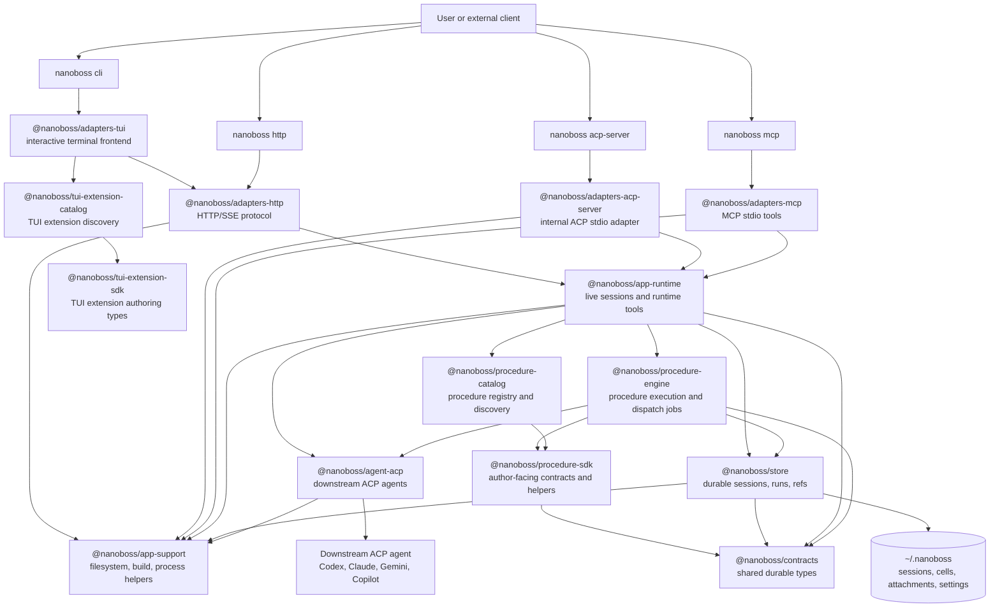
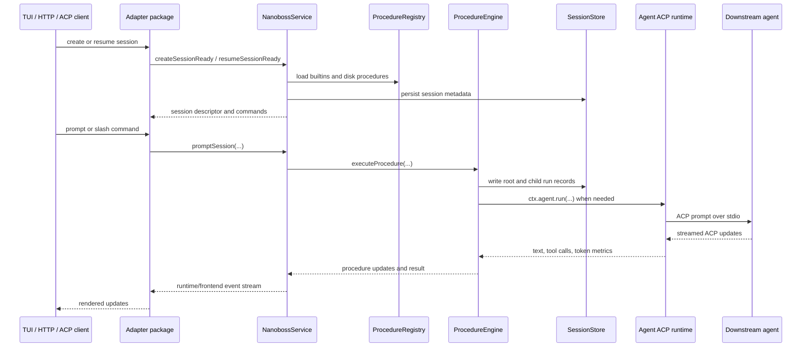
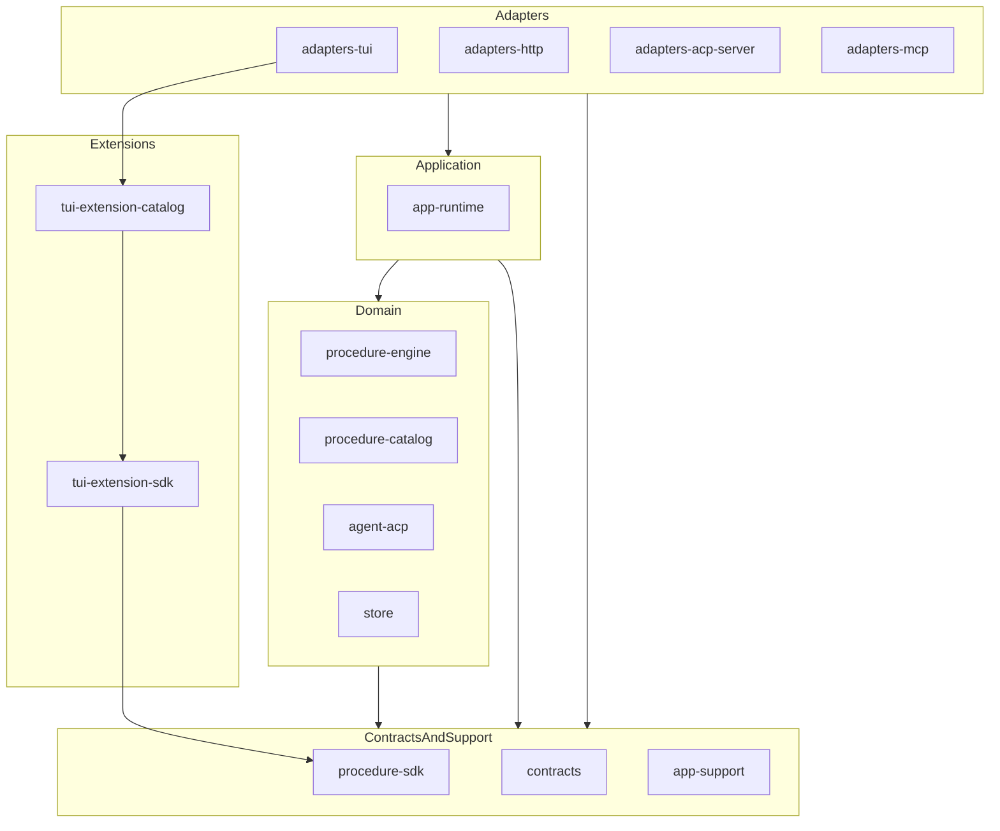
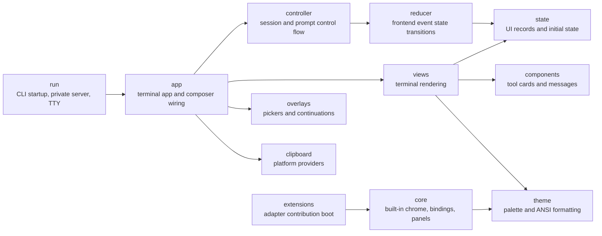

# Nanoboss Architecture and Refactor Review

Date: 2026-05-06

Review range: `15ae394..HEAD` on branch
`audit/15ae394-to-head-20260505`.

This document describes how Nanoboss operates after the package-boundary and
simplification refactor. It also records a code-review opinion on whether the
branch achieves the refactor goal of simplifying the implementation.

## Executive Opinion

The refactor achieves the most important simplification goal: ownership is now
much clearer. Public package surfaces are explicit, helper-policy ownership is
guarded by tests, TUI internals are grouped by owner directory, and package
dependency layering is both declared and tested.

The refactor is not a pure reduction in implementation size. It trades a few
large mixed-concern files for more files and more package-level structure:

- package `src` TypeScript files increased from 161 to 316
- package `src` TypeScript lines increased from about 27,801 to 30,143
- `packages/adapters-tui/src` files increased from 47 to 159
- `packages/adapters-tui/src` lines increased from about 7,917 to 10,414

That tradeoff is acceptable because the new files mostly encode durable
ownership, and the branch adds tests that prevent the old duplicate-helper and
cross-layer drift from returning. I would commit this PR ahead of the remaining
follow-on work if pre-commit is green. The follow-ons are worthwhile, but they
are not blockers for this branch.

## Whole-Project Shape

The project now has four adapter entry paths into one runtime core:

| Entry path | Adapter package | Runtime call path |
| --- | --- | --- |
| `nanoboss cli` | `@nanoboss/adapters-tui` plus `@nanoboss/adapters-http` | private local HTTP/SSE server to `NanobossService` |
| `nanoboss http` | `@nanoboss/adapters-http` | direct HTTP/SSE calls to `NanobossService` |
| `nanoboss acp-server` | `@nanoboss/adapters-acp-server` | ACP stdio calls to `NanobossService` |
| `nanoboss mcp` | `@nanoboss/adapters-mcp` | MCP stdio calls to `NanobossRuntimeService` |

## Runtime Flow

Foreground sessions use `NanobossService`. Tool-style clients use
`NanobossRuntimeService`, a narrower service for MCP operations such as listing
runs, reading refs, getting schemas, and starting or waiting on async dispatch
jobs.

## Package Layers

The current branch adds tests for this shape:

- package manifests must declare only allowed workspace dependencies
- the allowed workspace dependency graph must stay acyclic
- package entrypoints must be explicit instead of wildcard barrels
- root code must import packages through package APIs, not package-internal paths
- guarded implementation packages must be free of relative import cycles

## TUI Internal Shape

`@nanoboss/adapters-tui` remains the largest package. The refactor moves it from
a flat prefix field into owner directories:

This is a meaningful improvement over large root files such as `app.ts`,
`controller.ts`, `reducer.ts`, and `views.ts`. The cost is navigation surface:
the TUI package now has 159 source files. The next TUI work should optimize for
stable directory-level ownership and import rules, not for additional splitting.

## Review: Modularity

The branch improves modularity in three concrete ways.

First, packages now have documented ownership. Each package has a boundary doc
in `docs/*-package.md` explaining what it owns, what it does not own, and which
neighbor owns adjacent behavior.

Second, public package surfaces are explicit. The branch removes or avoids
wildcard package barrels, deletes root shims, and guards canonical imports in
`tests/unit/public-package-entrypoints.test.ts`.

Third, helper-policy ownership is no longer informal. Tests guard canonical
owners for support helpers, procedure SDK helpers, cancellation policy, procedure
UI marker payloads, timing traces, tool payload normalization, and TUI helper
families.

Remaining modularity concern: `@nanoboss/adapters-tui` and
`@nanoboss/app-runtime` are still coordination-heavy packages. That is mostly
inherent, but new behavior should enter them through existing owner directories
and runtime APIs rather than new top-level helper concepts.

## Review: Accidental Complexity

The refactor removes several forms of accidental complexity:

- duplicate helpers are collapsed behind canonical owners
- fallback paths are explicitly classified and covered by tests
- package dependency direction is encoded in a test instead of reviewer memory
- known import cycles across guarded package implementations are blocked
- the old root shim paths are gone

The main accidental-complexity risk is over-decomposition. Some modules now
exist because large files were split, not because the module name is an obvious
domain concept. That is acceptable for this branch because the hardening commits
converted the worst cases into directory-owned implementation files and removed
several thin duplicate owners.

The branch should not start another broad "split more files" campaign. The next
campaign should be convergence: fewer concepts, stronger import rules, and
folding thin helpers into durable owners when they have only one reason to
change.

## Review: Correctness

I did not find a blocking correctness issue in the current branch state.

The current branch specifically addresses the earlier high-risk correctness
concerns:

- `getNanobossHome()` now has a single canonical owner in
  `@nanoboss/app-support`
- cancellation policy now has a single canonical owner in
  `@nanoboss/procedure-sdk`
- the untyped procedure UI marker payload prefix/parser now has a single
  canonical owner in `@nanoboss/procedure-sdk`
- relative import cycles are guarded in TUI, runtime, engine, store, and agent
  implementation code
- intentional fallbacks are classified as persisted-data compatibility,
  user-facing resilience, or tool-server convenience

Correctness residual risk is mostly integration risk. The branch changes 355
files across adapters, runtime, procedure execution, agent transport, store, and
tests. Existing tests cover the intended architecture properties, but manual
TUI smoke testing is still useful because much of the TUI behavior is
interaction-heavy and visually rendered.

## Follow-On Work

Recommended follow-on work, in priority order:

1. Add a TUI directory import-layer test. The package is now directory-grouped,
   but the allowed import direction between `app`, `controller`, `reducer`,
   `views`, `core`, and `run` is not yet encoded.
2. Consolidate thin one-caller helper modules after the branch lands. Prefer
   folding helpers into durable owners over continuing to split by line count.
3. Add more adapter-level smoke tests for the full CLI/private-server path and
   the ACP-server path. The current unit coverage is strong on architecture
   guards, but full adapter integration remains the highest-risk behavior.
4. Keep fallback classification current. New fallback behavior should carry a
   category and a test, or it should be deleted.
5. Periodically review TUI source-file count. A large number of small files is
   only simpler if ownership remains obvious.

## Commit Decision

This PR can be committed ahead of the follow-on work if `bun run
check:precommit` passes.

Reason: the branch now improves the durable architecture rather than merely
moving code around. The remaining work is refinement and additional guardrails,
not a blocker to accepting the current refactor.
