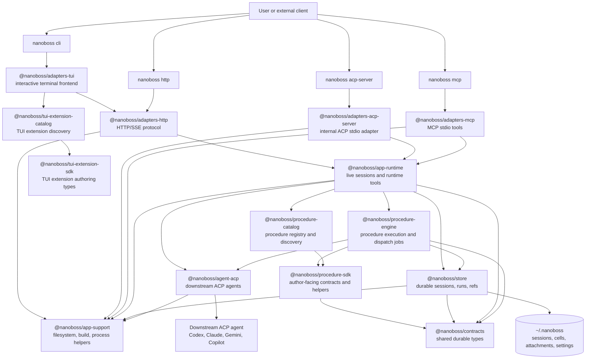
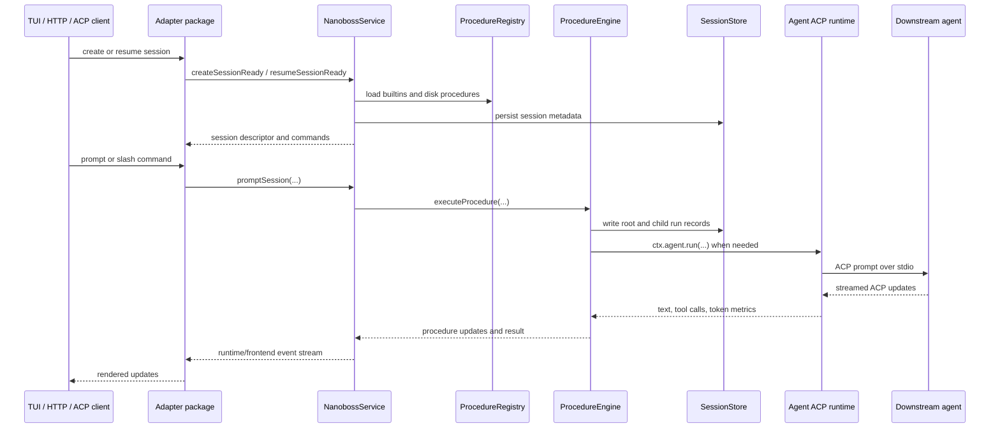
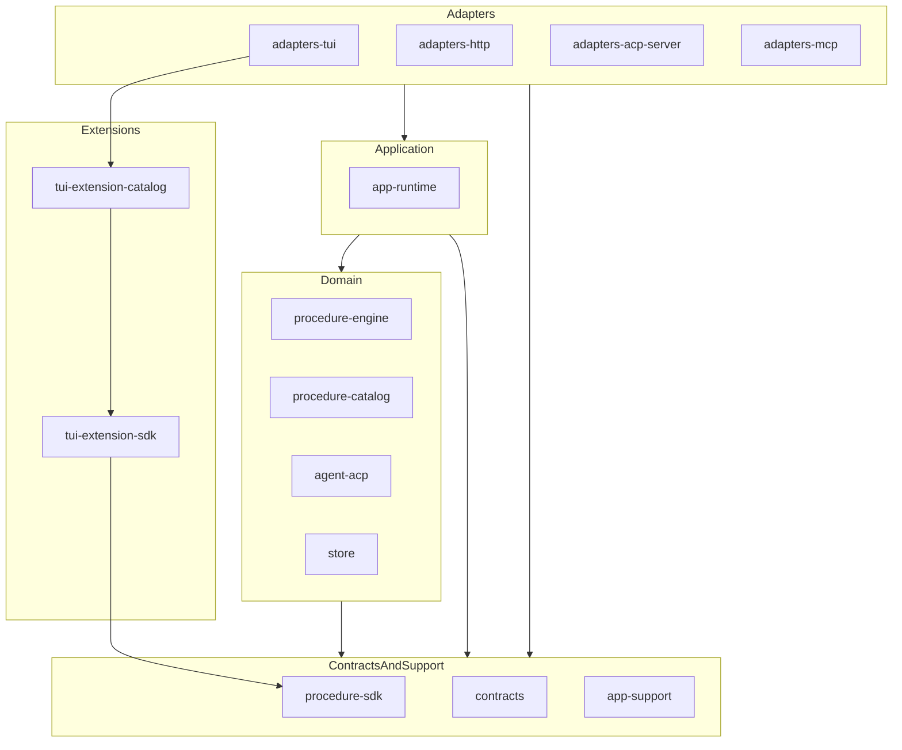
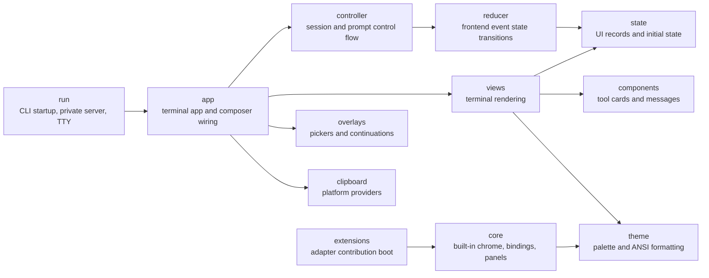

# Nanoboss Architecture

Last updated: 2026-05-06

This document describes the current Nanoboss runtime architecture, package
layers, entry paths, and major ownership boundaries.

## Whole-Project Shape

The project now has four adapter entry paths into one runtime core:

| Entry path | Adapter package | Runtime call path |
| --- | --- | --- |
| `nanoboss cli` | `@nanoboss/adapters-tui` plus `@nanoboss/adapters-http` | private local HTTP/SSE server to `NanobossService` |
| `nanoboss http` | `@nanoboss/adapters-http` | direct HTTP/SSE calls to `NanobossService` |
| `nanoboss acp-server` | `@nanoboss/adapters-acp-server` | ACP stdio calls to `NanobossService` |
| `nanoboss mcp` | `@nanoboss/adapters-mcp` | MCP stdio calls to `NanobossRuntimeService` |

## Runtime Flow

Foreground sessions use `NanobossService`. Tool-style clients use
`NanobossRuntimeService`, a narrower service for MCP operations such as listing
runs, reading refs, getting schemas, and starting or waiting on async dispatch
jobs.

## Package Layers

The package architecture is guarded by tests that require:

- package manifests must declare only allowed workspace dependencies
- the allowed workspace dependency graph must stay acyclic
- package entrypoints must be explicit instead of wildcard barrels
- root code must import packages through package APIs, not package-internal paths
- guarded implementation packages must be free of relative import cycles

## Package Responsibilities

| Package | Owns |
| --- | --- |
| `@nanoboss/adapters-tui` | Interactive terminal frontend, private local server boot, terminal rendering, TUI state, and extension contribution boot |
| `@nanoboss/adapters-http` | HTTP and SSE protocol surface for foreground runtime sessions |
| `@nanoboss/adapters-acp-server` | Internal ACP stdio adapter for runtime sessions |
| `@nanoboss/adapters-mcp` | MCP stdio tools for session, run, ref, schema, and async procedure dispatch operations |
| `@nanoboss/app-runtime` | Live session orchestration, runtime event publication, prompt execution entrypoints, and runtime service APIs |
| `@nanoboss/procedure-engine` | Procedure execution, child run recording, dispatch jobs, cancellation watching, and procedure result shaping |
| `@nanoboss/procedure-catalog` | Built-in and disk procedure discovery and registry loading |
| `@nanoboss/store` | Durable session, run, cell, attachment, and ref persistence |
| `@nanoboss/agent-acp` | Downstream ACP agent process management and streamed agent interaction |
| `@nanoboss/procedure-sdk` | Procedure author contracts, helper APIs, cancellation policy, procedure UI marker contracts, and procedure-facing result types |
| `@nanoboss/contracts` | Shared durable data contracts used across runtime, engine, store, and SDK boundaries |
| `@nanoboss/app-support` | Filesystem, build, process, environment, and shared app support helpers |
| `@nanoboss/tui-extension-catalog` | TUI extension discovery and loading |
| `@nanoboss/tui-extension-sdk` | TUI extension authoring types and contracts |

## TUI Internal Shape

`@nanoboss/adapters-tui` is organized by owner directory:

Each directory owns a stable TUI concern. New TUI behavior should enter through
the existing owner directory and public local APIs for that concern.

## Persistence

Nanoboss persists workspace-independent runtime state under `~/.nanoboss`.
Session, run, cell, attachment, and stored ref materialization are owned by
`@nanoboss/store`; runtime packages should use store APIs instead of shaping
durable records directly.

## Agent Execution

Procedure execution that needs a downstream model flows through
`@nanoboss/procedure-engine` into `@nanoboss/agent-acp`. The engine owns
Nanoboss run records, dispatch job lifecycle, cancellation observation, and
procedure-facing output events. The agent package owns ACP process transport,
model selection at the ACP boundary, and streamed child-agent communication.

## Extensions

TUI extension discovery is separate from extension authoring contracts.
`@nanoboss/tui-extension-catalog` locates and loads contributions, while
`@nanoboss/tui-extension-sdk` defines the types extension authors consume.
